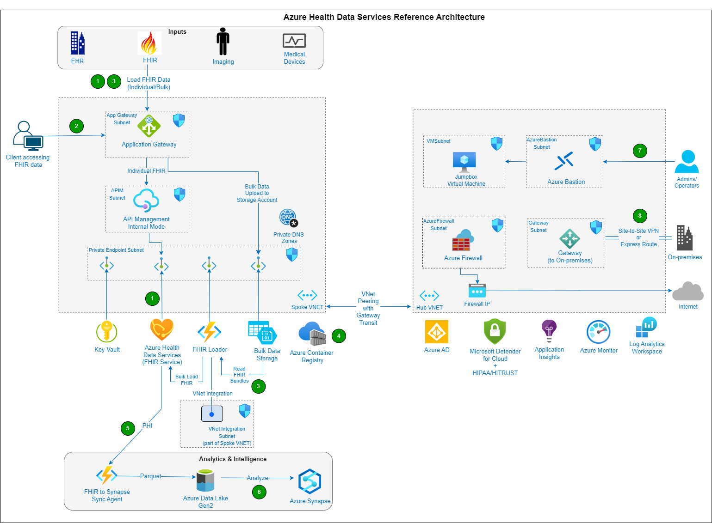

# Azure Health Data Services Reference Architecture

This repo provides reference architecture and reference implementation on how to deploy Azure Health Data Services securely on Azure and integrate with various Azure services.



### Getting Started

- Clone the repo

  ```sh
  git clone https://github.com/UmarMohamedUsman/AHDS-Landing-Zone-Accelerator
  ```

- Open this folder in Visual Studio Code to review all the "parameters-\*" files under three folders (01-Network-Hub, 02-Network-LZ & 03-AHDS) to review the values and change as needed per your environment.

  - For example under 01-Network-Hub folder you have following three "parameters-\*" files, make sure to review all three of them. - parameters-deploy-vm.json - parameters-main.json - parameters-updateUDR.json

- Using Visual Studio Code review and change "deployment.azcli" file under "Scenarios/Baseline/bicep" folder. For example, change Names and Azure Region as needed.
  <br/>

- Execute the commands in "deployment.azcli"

### Testing

Once the reference architecture successfully deployed you can test the solution using Postman.

- Visit another page and follow the instructions for setting up Postman
- Make API calls to test FHIR service using Postman

To begin, CTRL+click (Windows or Linux) or CMD+click (Mac) on the link below to open a Postman tutorial in a new browser tab.

[Postman Setup Tutorial](https://github.com/microsoft/azure-health-data-services-workshop/blob/main/resources/docs/Postman_FHIR_service_README.md)
